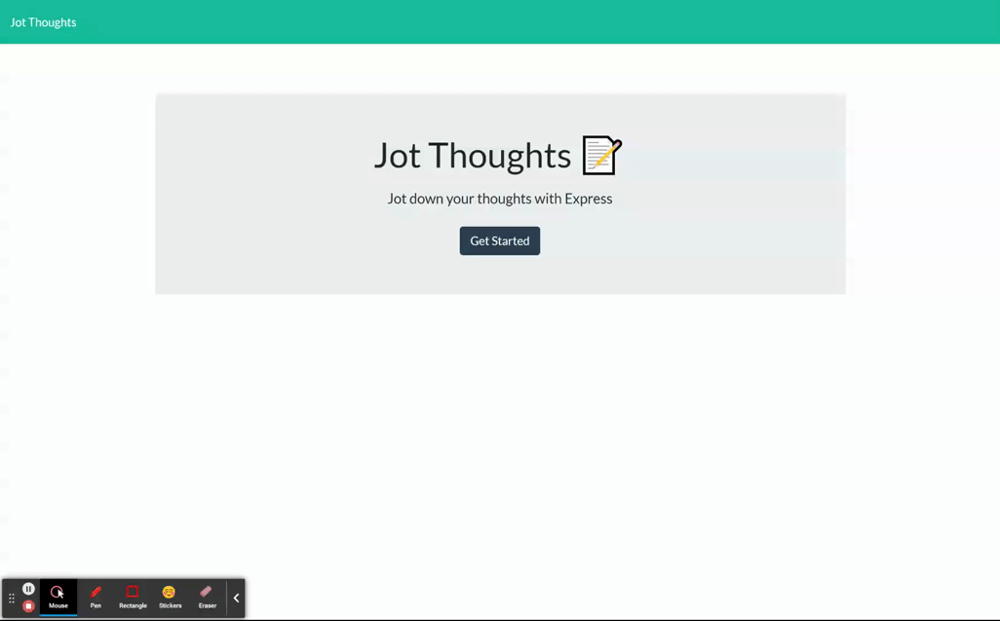

# Jot Thoughts

## Deployed Heroku Application Link
https://jot-thougts.herokuapp.com/

## License

## Table of Contents
1. [Project Description](#project-description)
2. [Installation Instructions](#installation-instructions)
3. [Usage Information](#usage-information)
4. [Contributor Guidelines](#contributor-guidelines)
5. [Testing Instructions](#testing-instructions)
6. [License Info](#license-info)
7. [Questions](#questions)

## Visual Demonstration

## Project Description
* The above screen capture demonstrates how this application works. The user can add a note title and descirption and save it to the column on the left side with the save icon on the top right of the navbar.

## Installation Instructions
* Pull the Github repository to your local drive, open it in an IDE and enter "npm install express" in the terminal to install the express node modules in the root folder. Then enter NPM start in the terminal and open up a new browser and enter http://localhost:3001/ in the url.

## Usage Information
* You can try out the app locally using the installation instructions above or test out the deployed application on Heroku with the URL https://jot-thougts.herokuapp.com/.

## Contributor Guidelines
* [Submit bugs and feature requests](https://github.com/joshsands/jot-thoughts/issues).
* Review [source code changes](https://github.com/joshsands/jot-thoughts/pulls).

## Test Instructions
* None

## License Info
Copyright 2021
The source code for the site is licensed under the MIT license and can be found at the link below:
[License Info Link](https://opensource.org/licenses/MIT)
      

## Questions?
* Find me on Github at [Joshsands](http://github.com/Joshsands).
* E-mail me at josh.sands@mail.com.
